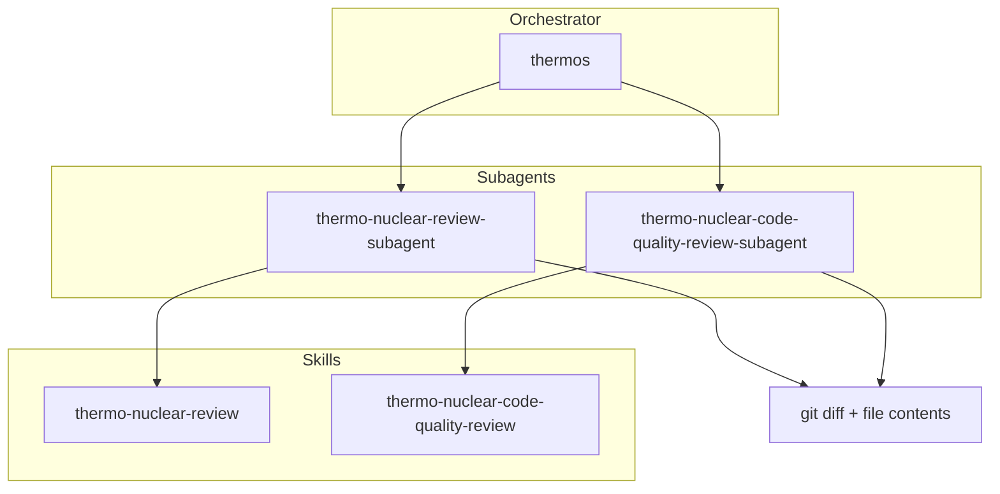

# Thermos plugin (Claude Code port)

Thermo-nuclear branch review for Claude Code agents: deep correctness and security audits, harsh maintainability rubrics, and parallel subagent orchestration.

> **This is a Claude Code port of the official Cursor Thermos plugin** (<https://github.com/cursor/plugins/tree/main/thermos>). The review rubrics, agent design, and architecture are Cursor's original work; this repository adapts them to Claude Code's plugin format, skill/agent frontmatter, and orchestration primitives. It is a port, not original art. See [LICENSE](LICENSE) for the combined MIT notice covering both Cursor (original) and the porter.

## Installation

```bash
/plugin marketplace add LayZeeDK/thermos-claude-plugin
/plugin install thermos@thermos-claude-plugin
```

## Architecture



## Skills

| Skill | Description |
|:------|:------------|
| `thermo-nuclear-review` | Deep branch audit (bugs, breakages, security, devex, feature-gate leaks). |
| `thermo-nuclear-code-quality-review` | Strict maintainability audit (code-judo, 1k-line rule, spaghetti, boundaries). |
| `thermos` | Run both review subagents in parallel and synthesize findings. |

## Agents

| Agent | Description |
|:------|:------------|
| `thermo-nuclear-review-subagent` | Diff-scoped subagent for the deep review rubric. |
| `thermo-nuclear-code-quality-review-subagent` | Diff-scoped subagent for the code-quality rubric. |

## Typical usage

**Double review (thermos):**

1. Gather `git diff main...HEAD` with the `Bash` tool and the full contents of the changed files with the `Explore` agent.
2. Launch both subagents in one message with `run_in_background: true`, passing each the same scoped diff/file context.
3. Collect both results with `TaskOutput`, then synthesize prioritized, deduplicated findings.

**Single skill:** invoke `thermo-nuclear-review` or `thermo-nuclear-code-quality-review` in the main agent, or the matching subagent after gathering diff context.

## License

MIT. This port preserves Cursor's original copyright and adds the porter's; see [LICENSE](LICENSE).
